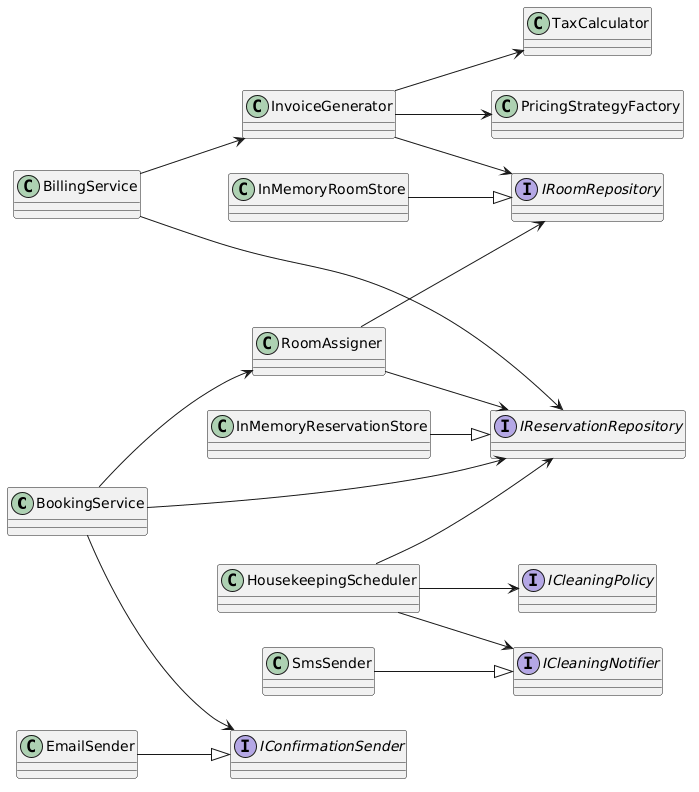

# Sprint 2 — Reponses

## Exercice 1 — Cartographie

### 1.1 Classes et interfaces publiques

IReservationRepository
IRoomRepository
IConfirmationSender
ICleaningNotifier
ICleaningPolicy
IPricingStrategy

BookingService
BillingService
HousekeepingScheduler

EmailSender
SmsSender
InMemoryReservationStore
InMemoryRoomStore
InvoiceGenerator
TaxCalculator
PricingStrategyFactory
RoomAssigner
StandardCleaningPolicy
VipCleaningPolicy
FlexibleCancellationPolicy
ModerateCancellationPolicy
StrictCancellationPolicy
NonRefundableCancellationPolicy
StandardPricingStrategy
SuitePricingStrategy
FamilyPricingStrategy

Reservation
Room
RoomType
Invoice
InvoiceLine
CleaningTask

### 1.2 Graphe de dependances

(Decrivez ou collez un schema)

### 1.3 Clusters identifies

- Cluster 1 : ...
  - Justification : ...
- Cluster 2 : ...
  - Justification : ...
- Cluster 3 : ...
  - Justification : ...

-Cluster Booking : BookingService, RoomAssigner, IConfirmationSender, IReservationRepository, IRoomRepository, Reservation, Room, RoomType
  -Ces classes changent quand les règles de réservation, check-in ou attribution de chambre évoluent. L'acteur est le réceptionniste.
-Cluster Billing : BillingService, InvoiceGenerator, TaxCalculator, PricingStrategyFactory, IPricingStrategy, Invoice, InvoiceLine
  -Ces classes changent quand la TVA, les tarifs ou le format de facture changent. L'acteur est le comptable.
-Cluster Housekeeping : HousekeepingScheduler, ICleaningPolicy, ICleaningNotifier, CleaningTask, StandardCleaningPolicy, VipCleaningPolicy
  -Ces classes changent quand la politique de ménage ou les canaux de notification changent. L'acteur est la gouvernante.

---

## Exercice 2 — Decoupage

### Modules crees

| Module | Justification |
|-------|---------------|
| ... | ... |

### Justification par principe

- **CCP** : (expliquez pourquoi vous avez regroupe certaines classes)
- **CRP** : (expliquez pourquoi vous avez separe certaines classes)
- **REP** : (expliquez la coherence de chaque module)

---

## Exercice 3 — Test de la modification

### Scenario A — Politique de menage

- Fichiers modifies : ...
- Modules impactes : ...
- Principe en jeu : ...

### Scenario B — Taux de TVA

- Fichiers modifies : ...
- Modules impactes : ...

### Scenario C — Push notification

- Fichiers crees : ...
- Fichiers modifies : ...
- Modules metier impactes : ...
- Principe en jeu : ...

### Comparaison avec le code de depart

(Paragraphe d'analyse)
